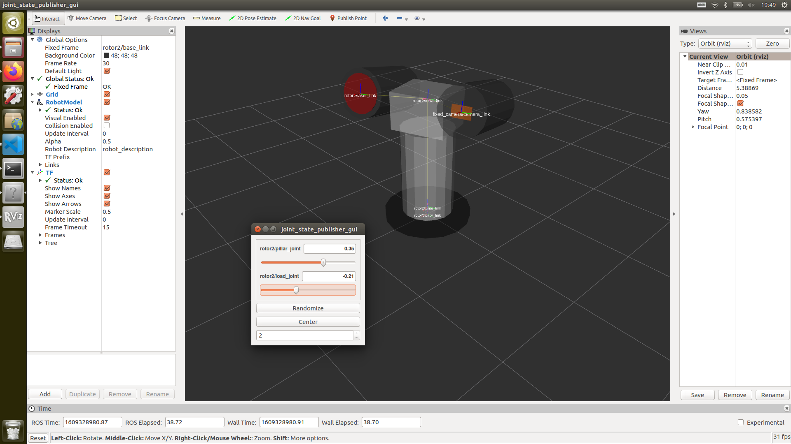
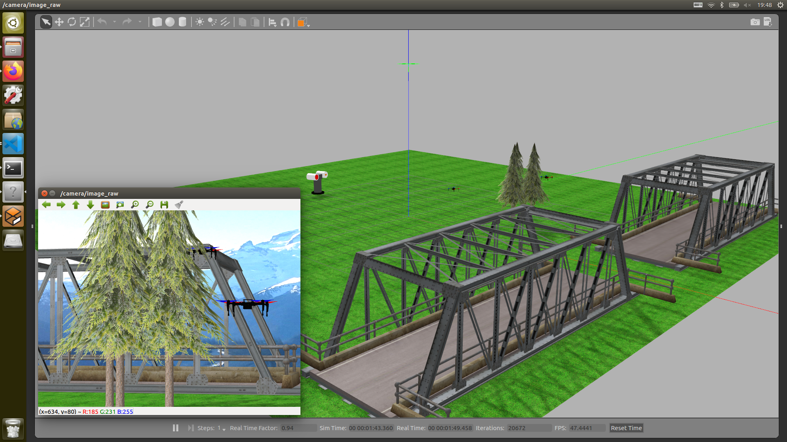

# et_simulator
## build
```Bash
$ sudo apt-get install ros-melodic-joint-state-publisher-gui
$ cd ~/catkin_ws/src
$ git clone https://github.com/TaoYibo1866/et_simulator_gazebo.git
$ git clone https://github.com/TaoYibo1866/uav_simulator_gazebo.git
$ cd ~/catkin_ws
$ catkin_make
```
## run
```Bash
$ roslaunch et_description display.launch
```

```Bash
$ roslaunch et_simulator laser_weapon_maunal.launch
```

```Bash
$ roslaunch et_simulator laser_weapon_auto.launch
```
